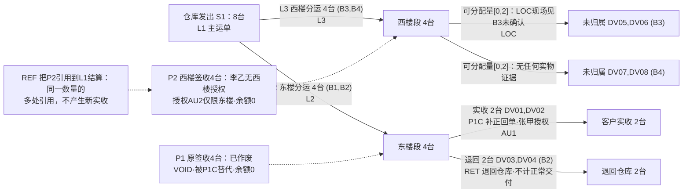

# S1 数量流图（发出 → 实收 / 退回 / 未归属）

```mermaid
flowchart LR
    WH["仓库发出 S1：8台<br/>L1 主运单"]
    WH -->|"L2 东楼分运 4台 (B1,B2)<br/>L2"| E["东楼段 4台"]
    WH -->|"L3 西楼分运 4台 (B3,B4)<br/>L3"| W["西楼段 4台"]
    E -->|"实收 2台 DV01,DV02<br/>P1C 补正回单·张甲授权AU1"| ER["客户实收 2台"]
    E -->|"退回 2台 DV03,DV04 (B2)<br/>RET 退回仓库·不计正常交付"| RT["退回仓库 2台"]
    W -->|"可分配量[0,2]：LOC现场见B3未确认<br/>LOC"| U1["未归属 DV05,DV06 (B3)"]
    W -->|"可分配量[0,2]：无任何实物证据"| U2["未归属 DV07,DV08 (B4)"]
    P1X["P1 原签收4台：已作废<br/>VOID·被P1C替代·余额0"] -.-> E
    P2X["P2 西楼签收4台：李乙无西楼授权<br/>授权AU2仅限东楼·余额0"] -.-> W
    REFX["REF 把P2引用到L1结算：同一数量的<br/>多处引用，不产生新实收"] -.-> P2X
```

合计：发出 8 = 实收 2 + 退回 2 + 未归属 4（余 0）。
未归属 4 台的可分配量均为 [0,1]/台：下界 0（无有效签收不能记实收），上界 1（可能在客户处未办手续），未知不等于丢失。
